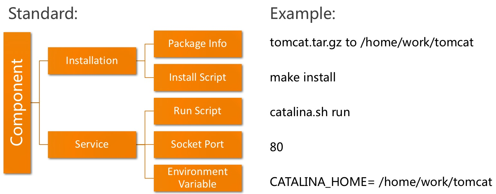
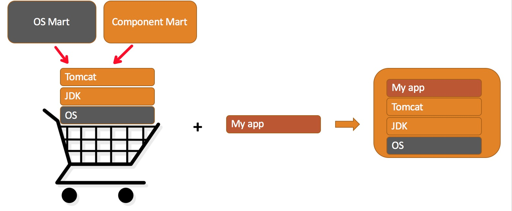

# docker-image-builder
通过组件化方式拼装一个Docker镜像。
你可以使用它：

* 告别繁琐的dockerfile编写
* 有序组织、运维镜像内的一些中间件

##什么是一个组件（Componennt）
组件是我们抽象出的一个最小服务单元的概念，它既可以是单独一个文件，也可以是一个安装包、SDK、web 容器。。

    整体上，我们把一个组件划分了两大阶段，分阶段定义它的行为：

    * 安装阶段
    * 服务阶段

这样做有几个好处：

* 灵活
* 按需定制
* 显著降低应用接入底层组件的代价
* 基本完全消除了docker image/dockerfile学习成本

同时，在组件间依赖调用方式规范的前提下，可以快速在上层应用无感知的情况下快速接入/更新一个组件，比如：

* 收集容器内运行应用日志
* JDK小版本升级
* 等等

由于各个企业的条件、环境差异较大，我们鼓励大家根据各自情况构建自己的组件库用于拼装镜像。

我们基于过去的成功经验，抽取了镜像制作的核心逻辑，规避了了一些非社区开源技术/组件，同时摒弃了存储、队列等外部依赖，带来了这个核心版的镜像制作工具。
希望对你有所帮助。

## 依赖
JDK 1.8+

[Docker Registry Server][1]

[Docker Engine with API][2]

[1]:https://docs.docker.com/registry/deploying/ "Docker Registry Server"
[2]:https://docs.docker.com/engine/api/v1.24/  "Docker Engine with API"